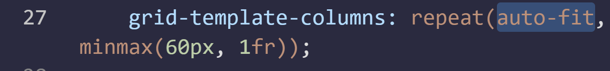
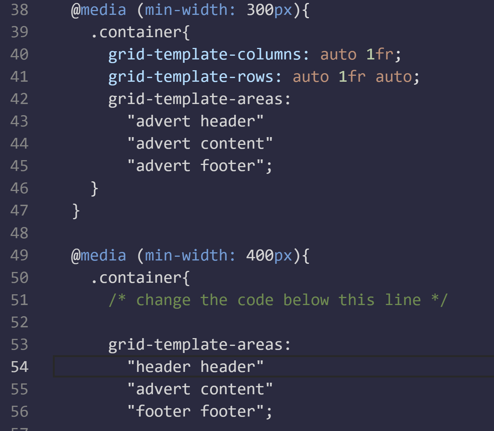

# Grids

>Grid - 

property| definition| values
---- | ---- | ----
grid-template-columns| width of the cells
grid-template-row| height of the cells
grid-gap| gap between cells
align-items| sets the vertical alignment of items in a grid| center; end;
justify-items| You can align the content's position within its cell horizontally. *By default, this property has a value of stretch*
grid-template-area| by default, this property has a value of stretch. **Every word in the code represents a cell and every pair of quotation marks represent a row.** | grid-template-areas: "header header header"  "advert content content" "footer footer footer";
grid-area| After creating an area's template for your grid container, you can place an item in your custom area by referencing the name you gave it.| 
grid-area| Without using grid area template |grid-area: horizontal line to start at / vertical line to start at / horizontal line to end at / vertical line to end at; 
repeat|  specify the number of times you want your column or row to be repeated, followed by a comma and the value you want to repeat.| 
minmax| used to limit the size of items when the grid container changes size.|  
autofill| Used to create flexible layouts| 
autofit| collapses or stretches to fit the container.| 

## Media queries

>Media queries - to rearrange grid areas, change dimensions of a grid, and rearrange the placement of items.

property| definition| values
---- | ---- | ----
min-width| | 

