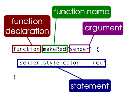

# Programming with javascript

## javascript uses

Type| Description| Example
---- | ---- | ----
access content| js can select any element, attribute, or text from html| select the text in all \<h1> elements
modify content| js can add elements, attributes and text to a page or remove them| add a paragraph, change the value of a class attribute to trigger new CSS rules
Program rules| you can specify a set of steps for the browser to follow.| gallery script could check which image a user clicked on and display a larger image. A calculator to collect values from a form. Move images
React to events| Run a script when a event occurs.| button pressed, a link is clicked, a cursur hovers over an element.

### Things javascript does.

* **Access** the content of the page
* **Modify** the content of the page
* **Program** rules or instructions the browser can follow
* **React** to events triggered by the user or browser.

ex: 
#### Reload a page
**React**: Script triggered when user clicks on links
**Access**: the link that they clicked on.
**Program**: Load the new content that was requested
**Access**: Find the element to replace in the page.
**Modify**: Replace that content with the new content

## Creating scripts

1. Define the goal
2. Design the script
3. Code each step

*An **object** consists of properties, events and methods.*
* **Properties** are the characteristics of the Object
    * **Types** - URL, lastmodified, title
* **Events** are when the user or browser does something. A page loading can be an event.
    * 
* **methods** are actions that can be performed on an object.

## Expressions

> an **expression** evaluates in to a single value.
* Expressions that are just **assigned** to a variable - var color = green;
* Expressions that use **two** or more values to **return** a **single** value - var area = 3 * 2;

## Operators
*pg 75 in JD book*
> Operators allow programmers to create a single value from one or more values.

Type| Description| Example
---- | ---- | ----
Assignment operators| Assign a value to a variable| color = 'green';
Arithmetic operators| Perform basic math| area = 3 * 2;
String operators| combine two strings| greeting = 'hi' + 'molly';
comparison operators|Compare two values and return true or false| = 3 > 5; *pg 150*
Logical operators| Combine expressions and return true or false| buy = (5 > 3) && (2 < 4); *pg 156*

### Arithmetic operators *pg 76*
Type| Description| Example
---- | ---- | ----
Addition|| +
Subtration|| -
Division|| /
Multipliction|| *
increment| Adds one to the current number| ++
Decrement| Subtracts one to the current number| --
Modulus| divides two values and returns the remainder| 10 % 3 = 1

### string operators *pg78*

*There is only one string operator, the + symbol

Example:
* var firstName = 'ivy';
* var lastName = 'Stone';
* var fullName = firstName + lastName;

> Mainly used for personalized messages

## Functions *pg 88*

> **Functions** let you group a series of statements together to perform a specific task. If different parts of a script repeat the same task, you can reuse the function.

keyword| Description
---- | ---- 
Calling| When you are retrieving a function.
Parameters| information passed to a function.
Return Value| The answer the function gives you.
function keyword|
function name|
Code block|
queue| an abstract Data Structure where items are kept in order
Example: 

\

> Parameter vs Arguments - Arguments specify values. Parameters don't.

#### Table of contents
[Learning Text Editor](https://will-ing.github.io/learning-journal/learn-text-editor)

[HTML Notes](https://will-ing.github.io/learning-journal/html-notes)

[Learning Markdown](https://will-ing.github.io/learning-journal/learning-markdown)

[Git Notes](https://will-ing.github.io/learning-journal/git-notes)

[CSS notes](https://will-ing.github.io/learning-journal/css-notes)

[JS notes](https://will-ing.github.io/learning-journal/js-notes)

[Programming notes](https://will-ing.github.io/learning-journal/progjs-notes)

[Operators and loops](https://will-ing.github.io/learning-journal/operatorsandloops)

[How computers work](https://will-ing.github.io/learning-journal/howcmpwrk)

[what I learned](https://will-ing.github.io/learning-journal/what-i-learned)

[Main page](https://will-ing.github.io/learning-journal/)